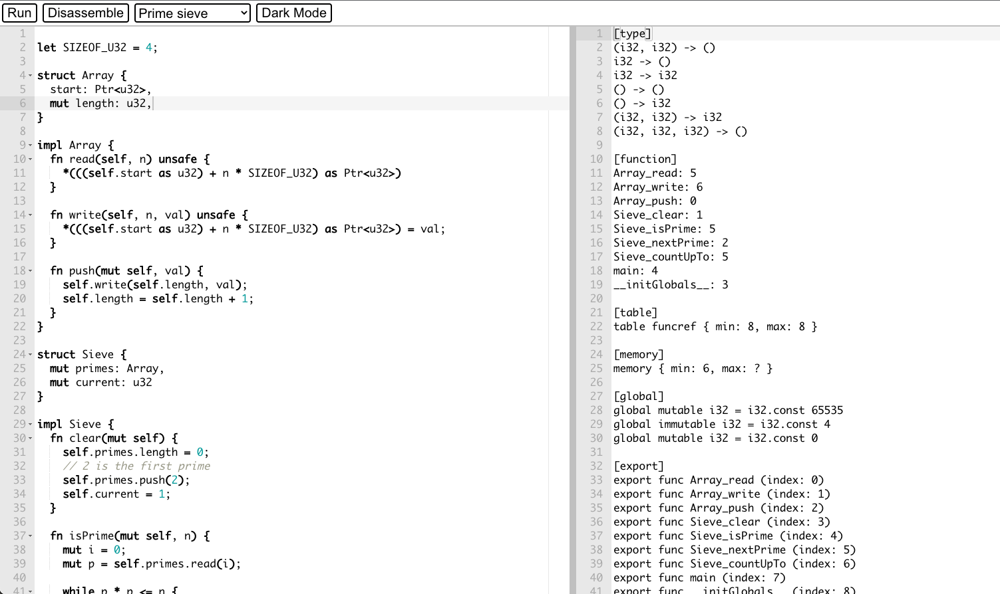

# ExpLang

A generic React component to create playgrounds to explore any programming language.

## Usage

Add the following peer dependencies to your `package.json`'s devDependencies :

```json
"@geoffcox/react-splitter": "^2.1.0",
"ace-builds": "^1.4.12",
"react-ace": "^9.4.0"
```

```typescript
import { Playground, ButtonActions, Samples } from 'explang';

// create as many actions as needed, they will be turned into buttons in the top bar
// here we create two buttons to run and disassemble a piece of code
const actions: ButtonActions = {
  Run: async (code, setOutput) => {
    setOutput('running...');
    const res = await compile(code);

    if (res.isSuccess) {
      setOutput(await run(res.output));
    } else {
      setOutput(`Error: ${res.error}`);
    }
  },
  Disassemble: async (code, setOutput) => {
    setOutput(await disassemble(code));
  },
};

const samples: Samples = {
  'Fibonacci': `fn fib(n: usize) { ... }`,
  'Factorial': `fn fact(n: usize) { ... }`,
};

export const App = () => (
  <Playground
    actions={actions}
    samples={samples}
    // available modes : https://github.com/thlorenz/brace/tree/master/mode
    aceMode='rust'
  />
);
```

## Screenshot

